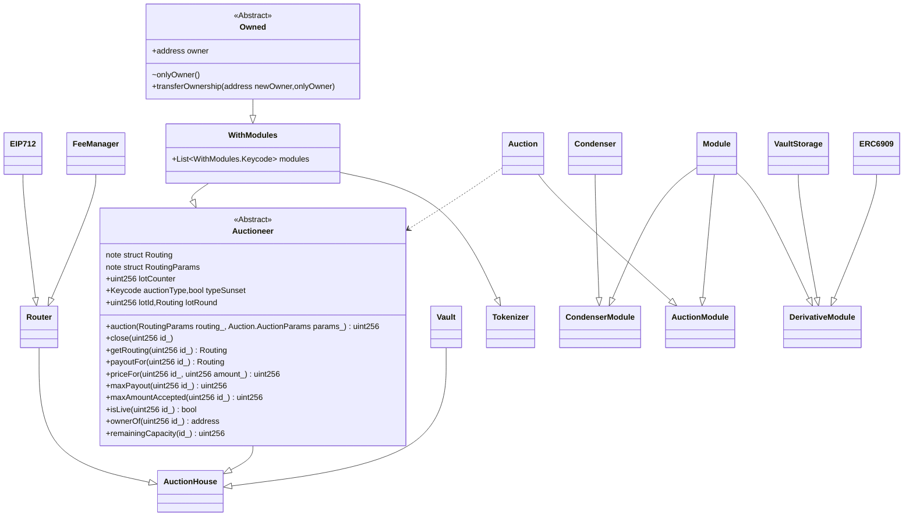

# Architecture Diagram

```mermaid
classDiagram
  EIP712 --|> Router
  FeeManager --|> Router

  Owned --|> WithModules
  class Owned {
    <<Abstract>>
    +address owner
    ~onlyOwner()
    +transferOwnership(address newOwner,onlyOwner)
  }

  WithModules --|> Auctioneer
  class WithModules {
    +List~WithModules.Keycode~ modules
  }

  Vault --|> AuctionHouse

  class Auctioneer {
    <<Abstract>>
    note struct Routing
    note struct RoutingParams
    +uint256 lotCounter
    +Keycode auctionType,bool typeSunset
    +uint256 lotId,Routing lotRound
    +auction(RoutingParams routing_, Auction.AuctionParams params_) uint256
    +close(uint256 id_)
    +getRouting(uint256 id_) Routing
    +payoutFor(uint256 id_) Routing
    +priceFor(uint256 id_, uint256 amount_) uint256
    +maxPayout(uint256 id_) uint256
    +maxAmountAccepted(uint256 id_) uint256
    +isLive(uint256 id_) bool
    +ownerOf(uint256 id_) address
    +remainingCapacity(id_) uint256
  }
  Auction ..> Auctioneer

  Auctioneer --|> AuctionHouse
  Router --|> AuctionHouse

  WithModules --|> Tokenizer

  Condenser --|> CondenserModule
  Module --|> CondenserModule

  Auction --|> AuctionModule
  Module --|> AuctionModule

  Module --|> DerivativeModule
  VaultStorage --|> DerivativeModule
  ERC6909 --|> DerivativeModule
```
