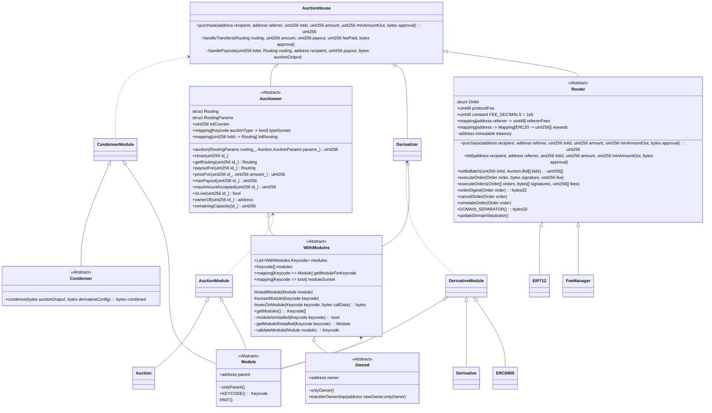

# Moonraker Contract Architecture

```mermaid
classDiagram
  direction BT
  EIP712 --|> Router
  FeeManager --|> Router

  Owned --|> WithModules
  class Owned {
    <<Abstract>>
    +address owner
    ~onlyOwner()
    +transferOwnership(address newOwner,onlyOwner)
  }

  WithModules --|> Auctioneer
  class WithModules {
    +List~WithModules.Keycode~ modules
  }

  class Auctioneer {
    <<Abstract>>
    struct Routing
    struct RoutingParams
    +uint256 lotCounter
    +mapping[Keycode auctionType -> bool] typeSunset
    +mapping[uint256 lotId -> Routing] lotRouting
    +auction(RoutingParams routing_, Auction.AuctionParams params_) uint256
    +close(uint256 id_)
    +getRouting(uint256 id_) Routing
    +payoutFor(uint256 id_) Routing
    +priceFor(uint256 id_, uint256 amount_) uint256
    +maxPayout(uint256 id_) uint256
    +maxAmountAccepted(uint256 id_) uint256
    +isLive(uint256 id_) bool
    +ownerOf(uint256 id_) address
    +remainingCapacity(id_) uint256
  }

  class Router {
    <<Abstract>>
    struct Order
    +uint48 protocolFee
    +uint48 constant FEE_DECIMALS = 1e5
    +mapping[address referrer -> uint48] referrerFees
    +mapping[address -> Mapping[ERC20 -> uint256]] rewards
    ~address immutable treasury
    +purchase(address recipient, address referrer, uint256 lotId, uint256 amount, uint256 minAmountOut, bytes approval): uint256
    +bid(address recipient, address referrer, uint256 lotId, uint256 amount, uint256 minAmountOut, bytes approval)
    +settleBatch(uint256 lotId, Auction.Bid[] bids): uint256[]
    +executeOrder(Order order, bytes signature, uint256 fee)
    +executeOrders(Order[] orders, bytes[] signatures, uint256[] fees)
    +orderDigest(Order order): bytes32
    +cancelOrder(Order order)
    +reinstateOrder(Order order)
    +DOMAIN_SEPARATOR(): bytes32
    +updateDomainSeparator()
  }

  class AuctionHouse {
    +purchase(address recipient, address referrer, uint256 lotId, uint256 amount, uint256 minAmountOut, bytes approval): uint256
    ~handleTransfers(Routing routing, uint256 amount, uint256 payout, uint256 feePaid, bytes approval)
    ~handlePayouts(uint256 lotId, Routing routing, address recipient, uint256 payout, bytes auctionOutput)
  }

  class Condenser {
    <<Abstract>>
    +condense(bytes auctionOutput, bytes derivativeConfig): bytes combined
  }

  class Module {
    <<Abstract>>
    +address parent
    ~onlyParent()
    +KEYCODE(): Keycode
    #INIT()
  }

  class WithModules {
    <<Abstract>>
    +Keycode[] modules
    +mapping[Keycode => Module] getModuleForKeycode
    +mapping[Keycode => bool] moduleSunset
    #installModule(Module module)
    #sunsetModule(Keycode keycode)
    #execOnModule(Keycode keycode, bytes callData): bytes
    +getModules(): Keycode[]
    ~moduleIsInstalled(Keycode keycode): bool
    ~getModuleIfInstalled(Keycode keycode): Module
    ~validateModule(Module module): Keycode
  }

  AuctionModule ..> Auctioneer

  DerivativeModule ..> Derivatizer
  
  CondenserModule ..> AuctionHouse
  Auctioneer --|> AuctionHouse
  Derivatizer --|> AuctionHouse
  Router --|> AuctionHouse

  WithModules --|> Derivatizer

  Condenser --|> CondenserModule
  Module --|> CondenserModule

  Auction --|> AuctionModule
  Module --|> AuctionModule

  Module --|> DerivativeModule
  Derivative --|> DerivativeModule
  ERC6909 --|> DerivativeModule

  Module ..> WithModules
  
```
