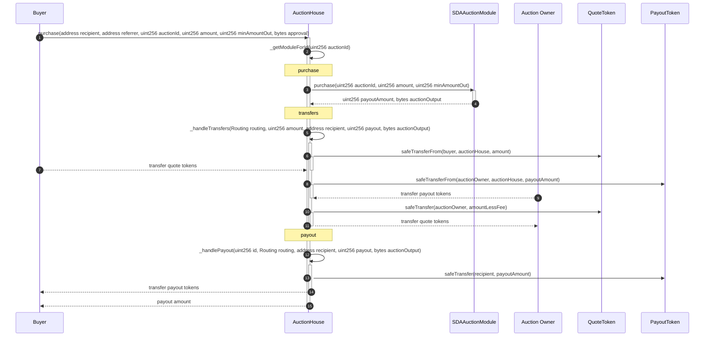

# Moonraker Architecture

## Contract

```mermaid
classDiagram
  direction BT
  EIP712 --|> Router
  FeeManager --|> Router

  class EIP712 {
    +eip712Domain() (bytes1 fields, string name, string version, uint256 chainId, address verifyingContract, bytes32 salt, uint256[] extensions)
  }

  Owned --|> WithModules
  class Owned {
    <<Abstract>>
    +address owner
    ~onlyOwner()
    +transferOwnership(address newOwner,onlyOwner)
  }

  WithModules --|> Auctioneer
  class WithModules {
    +List~WithModules.Keycode~ modules
  }

  class Auctioneer {
    <<Abstract>>
    struct Routing
    struct RoutingParams
    +uint256 lotCounter
    +mapping[Keycode auctionType -> bool] typeSunset
    +mapping[uint256 lotId -> Routing] lotRouting
    +auction(RoutingParams routing_, Auction.AuctionParams params_) uint256
    +close(uint256 id_)
    +getRouting(uint256 id_) Routing
    +payoutFor(uint256 id_) Routing
    +priceFor(uint256 id_, uint256 amount_) uint256
    +maxPayout(uint256 id_) uint256
    +maxAmountAccepted(uint256 id_) uint256
    +isLive(uint256 id_) bool
    +ownerOf(uint256 id_) address
    +remainingCapacity(id_) uint256
  }

  class Router {
    <<Abstract>>
    struct Order
    +uint48 protocolFee
    +uint48 constant FEE_DECIMALS = 1e5
    +mapping[address referrer -> uint48] referrerFees
    +mapping[address -> Mapping[ERC20 -> uint256]] rewards
    ~address immutable treasury
    +purchase(address recipient, address referrer, uint256 lotId, uint256 amount, uint256 minAmountOut, bytes approval): uint256
    +bid(address recipient, address referrer, uint256 lotId, uint256 amount, uint256 minAmountOut, bytes approval)
    +settleBatch(uint256 lotId, Auction.Bid[] bids): uint256[]
    +executeOrder(Order order, bytes signature, uint256 fee)
    +executeOrders(Order[] orders, bytes[] signatures, uint256[] fees)
    +orderDigest(Order order): bytes32
    +cancelOrder(Order order)
    +reinstateOrder(Order order)
    +DOMAIN_SEPARATOR(): bytes32
    +updateDomainSeparator()
  }

  class AuctionHouse {
    +purchase(address recipient, address referrer, uint256 lotId, uint256 amount, uint256 minAmountOut, bytes approval): uint256
    ~handleTransfers(Routing routing, uint256 amount, uint256 payout, uint256 feePaid, bytes approval)
    ~handlePayouts(uint256 lotId, Routing routing, address recipient, uint256 payout, bytes auctionOutput)
  }

  class Condenser {
    <<Abstract>>
    +condense(bytes auctionOutput, bytes derivativeConfig): bytes combined
  }

  class Module {
    <<Abstract>>
    +address parent
    ~onlyParent()
    +KEYCODE(): Keycode
    #INIT()
  }

  class WithModules {
    <<Abstract>>
    +Keycode[] modules
    +mapping[Keycode => Module] getModuleForKeycode
    +mapping[Keycode => bool] moduleSunset
    #installModule(Module module)
    #sunsetModule(Keycode keycode)
    #execOnModule(Keycode keycode, bytes callData): bytes
    +getModules(): Keycode[]
    ~moduleIsInstalled(Keycode keycode): bool
    ~getModuleIfInstalled(Keycode keycode): Module
    ~validateModule(Module module): Keycode
  }

  AuctionModule ..> Auctioneer

  DerivativeModule ..> Derivatizer
  
  CondenserModule ..> AuctionHouse
  Auctioneer --|> AuctionHouse
  Derivatizer --|> AuctionHouse
  Router --|> AuctionHouse

  WithModules --|> Derivatizer

  Condenser --|> CondenserModule
  Module --|> CondenserModule

  Auction --|> AuctionModule
  Module --|> AuctionModule

  class Auction {
    <<interface>>
    struct Lot
    struct Bid
    struct AuctionParams
    +bool allowNewMarkets
    +uint48 minAuctionDuration
    ~uint48 ONE_HUNDRED_PERCENT = 1e5
    +mapping[uint256 id => Lot] lotData
    +purchase(uint256 id_, uint256 amount_, uint256 minAmountOut_) (uint256, bytes)
    +settle(uint256 id_, Bid[] bids_) uint256[]
    +createAuction(uint256 id_, bytes param_)
    +closeAuction(uint256 id_)
    +getRouting(uint256 id_) Routing
    +payoutFor(uint256 id_, uint256 amount_) uint256
    +maxPayout(uint256 id_) uint256
    +maxAmountAccepted(uint256 id_) uint256
    +isLive(uint256 id_) bool
    +ownerOf(uint256 id_) address
    +remainingCapacity(uint256 id_) uint256
  }

  class AuctionModule {
    <<abstract>>
    +purchase(uint256 id_, uint256 amount_, uint256 minAmountOut_) uint256
    +settle(uint256 id_, Bid[] bids_) uint256[]
    +createAuction(uint256 id_, AuctionParams params_)
    +closeAuction(uint256 id_)
    +getRouting(uint256 id_) Routing
    +isLive(uint256 id_) bool
    +ownerOf(uint256 id_) address
    +remainingCapacity(uint256 id_) uint256
  }

  Module --|> DerivativeModule
  Derivative --|> DerivativeModule
  ERC6909 --|> DerivativeModule

  class Derivative {
    <<abstract>>
    struct Token
    +mapping[Keycode dType => address] wrappedImplementations
    +mapping[uint256 tokenId => Token] tokenMetadata
    +mapping[uint256 lotId => uint256[]] lotDerivatives
    +deploy(bytes data, bool wrap) (uint256, address)
    +mint(bytes data, uint256 amount, bool wrap) bytes
    +mint(uint256 tokenId, uint256 amount, bool wrap) bytes
    +redeem(bytes data, uint256 amount)
    +exercise(bytes data, uint256 amount)
    +reclaim(bytes data)
    +convert(bytes data, uint256 amount)
    +wrap(uint256 tokenId, uint256 amount)
    +unwrap(uint256 tokenId, uint256 amount)
    +exerciseCost(bytes data, uint256 amount) uint256
    +convertsTo(bytes data, uint256 amount) uint256
    +computeId(bytes params_) uint256
  }

  class ERC6909 {
    <<abstract>>
    +mapping[uint256 => uint256] totalSupply
    +mapping[address => mapping[address => bool]] isOperator
    +mapping[address => mapping[uint256 => uint256]] balanceOf
    +mapping[address => mapping[address => mapping[uint256 => uint256]]] allowance
    +transfer(address receiver, uint256 id, uint256 amount) bool
    +transferFrom(address sender, address receiver, uint256 id, uint256 amount) bool
    +approve(address spender, uint256 id, uint256 amount) bool
    +setOperator(address operator, bool approved) bool
    +supportsInterface(bytes4 interfaceId) bool
  }

  Module ..> WithModules
  
```

## Processes

### Create an Auction

```mermaid
sequenceDiagram
  autoNumber
  participant Auction Owner
  participant AuctionHouse
  participant SDAAuctionModule

  Auction Owner->>AuctionHouse: Auctioneer.auction(RoutingParams routing, Auction.AuctionParams params)
  activate AuctionHouse
    AuctionHouse->>AuctionHouse: _getModuleIfInstalled(auctionType)

    AuctionHouse->>SDAAuctionModule: auction(uint256 id, Auction.AuctionParams params)
    activate SDAAuctionModule
      SDAAuctionModule->>SDAAuctionModule: AuctionModule.createAuction(AuctionParams auctionParams)
      Note right of SDAAuctionModule: validation, creates Lot record
      SDAAuctionModule->>SDAAuctionModule: _createAuction(uint256 id, Lot lot, bytes implParams)
      Note right of SDAAuctionModule: module-specific actions

      SDAAuctionModule-->>AuctionHouse: 
    deactivate SDAAuctionModule

    Note over AuctionHouse: store routing information
  deactivate AuctionHouse

  AuctionHouse-->>Auction Owner: auction id
```

### Purchase from an Auction

#### No Derivative

```mermaid
sequenceDiagram
  autoNumber
  participant Buyer
  participant AuctionHouse
  participant SDAAuctionModule
  participant Auction Owner
  participant QuoteToken
  participant PayoutToken
  
  Buyer->>AuctionHouse: purchase(address recipient, address referrer, uint256 auctionId, uint256 amount, uint256 minAmountOut, bytes approval)
  activate AuctionHouse
    AuctionHouse->>AuctionHouse: _getModuleForId(uint256 auctionId)

    Note over AuctionHouse: purchase

    AuctionHouse->>SDAAuctionModule: purchase(uint256 auctionId, uint256 amount, uint256 minAmountOut)
    activate SDAAuctionModule
      SDAAuctionModule-->>AuctionHouse: uint256 payoutAmount, bytes auctionOutput
    deactivate SDAAuctionModule

    Note over AuctionHouse: transfers

    AuctionHouse->>AuctionHouse: _handleTransfers(Routing routing, uint256 amount, address recipient, uint256 payout, bytes auctionOutput)
    activate AuctionHouse

      AuctionHouse->>QuoteToken: safeTransferFrom(buyer, auctionHouse, amount)
      activate AuctionHouse
        Buyer-->>AuctionHouse: transfer quote tokens
      deactivate AuctionHouse

      AuctionHouse->>PayoutToken: safeTransferFrom(auctionOwner, auctionHouse, payoutAmount)
      activate AuctionHouse
        Auction Owner-->>AuctionHouse: transfer payout tokens
      deactivate AuctionHouse

      AuctionHouse->>QuoteToken: safeTransfer(auctionOwner, amountLessFee)
      activate AuctionHouse
        AuctionHouse-->>Auction Owner: transfer quote tokens
      deactivate AuctionHouse
    deactivate AuctionHouse

    Note over AuctionHouse: payout

    AuctionHouse->>AuctionHouse: _handlePayout(uint256 id, Routing routing, address recipient, uint256 payout, bytes auctionOutput)
    activate AuctionHouse
      AuctionHouse->>PayoutToken: safeTransfer(recipient, payoutAmount)
      AuctionHouse-->>Buyer: transfer payout tokens
    deactivate AuctionHouse

    AuctionHouse-->>Buyer: payout amount
  deactivate AuctionHouse
```
