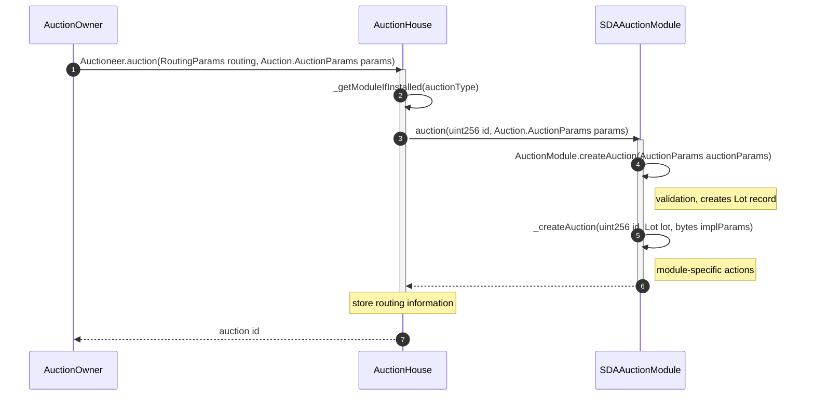
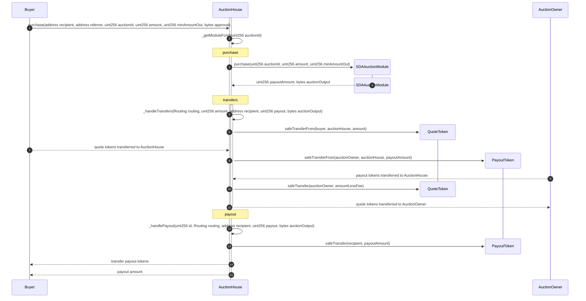
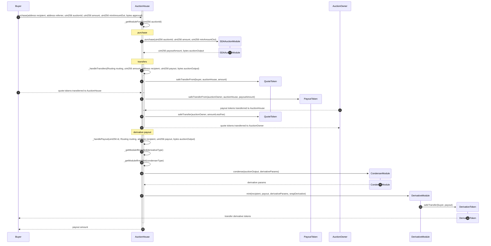
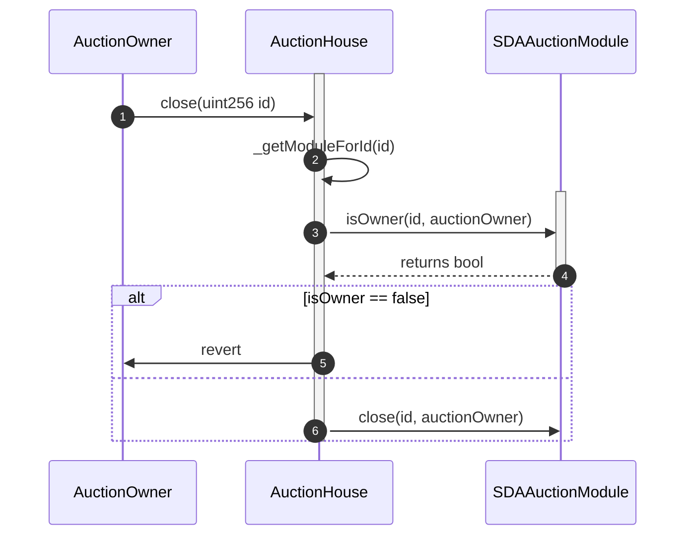

# Moonraker Architecture

## Contract

```mermaid
classDiagram
  direction BT
  FeeManager --|> Router

  Owned --|> WithModules
  class Owned {
    <<Abstract>>
    +address owner
    ~onlyOwner()
    +transferOwnership(address newOwner,onlyOwner)
  }

  WithModules --|> Auctioneer
  class WithModules {
    <<Abstract>>
    +List~WithModules.Keycode~ modules
  }

  class Auctioneer {
    <<Abstract>>
    struct Routing
    struct RoutingParams
    +uint256 lotCounter
    +mapping[Keycode auctionType -> bool] typeSunset
    +mapping[uint256 lotId -> Routing] lotRouting
    +createAuction(RoutingParams routing, Auction.AuctionParams params) uint256
    +closeAuction(uint256 lotId)
    +getRouting(uint256 lotId) Routing
    +payoutFor(uint256 lotId) Routing
    +priceFor(uint256 lotId, uint256 amount) uint256
    +maxPayout(uint256 lotId) uint256
    +maxAmountAccepted(uint256 lotId) uint256
    +isLive(uint256 lotId) bool
    +ownerOf(uint256 lotId) address
    +remainingCapacity(lotId) uint256
  }

  class FeeManager {
    <<Abstract>>
    +uint48 protocolFee
    +uint48 constant FEE_DECIMALS = 1e5
    +mapping[address referrer -> uint48] referrerFees
    +mapping[address -> mapping[ERC20 -> uint256]] rewards
    +claimFees(): uint256
  }

  class Router {
    <<Abstract>>
    ~address immutable treasury
    +purchase(address recipient, address referrer, uint256 lotId, uint256 amount, uint256 minAmountOut, bytes auctionData, bytes approval): uint256
    +bid(address recipient, address referrer, uint256 lotId, uint256 amount, uint256 minAmountOut, bytes auctionData, bytes approval)
    +settle(uint256 lotId): uint256[]
    +settle(uint256 lotId, Auction.Bid[] bids): uint256[]
  }

  class Derivatizer {
    
  }

  class AuctionHouse {
    +purchase(address recipient, address referrer, uint256 lotId, uint256 amount, uint256 minAmountOut, bytes auctionData, bytes approval): uint256
    ~handleTransfers(Routing routing, uint256 amount, uint256 payout, uint256 feePaid, bytes approval)
    ~handlePayouts(uint256 lotId, Routing routing, address recipient, uint256 payout, bytes auctionOutput)
    +bid(address recipient, address referrer, uint256 lotId, uint256 amount, uint256 minAmountOut, bytes32 auctionData, bytes approval)
    +settle(uint256 lotId): uint256[]
    +settle(uint256 lotId, Auction.Bid[] bids): uint256[]
  }

  class Condenser {
    <<Abstract>>
    +condense(bytes auctionOutput, bytes derivativeConfig): bytes combined
  }

  class Module {
    <<Abstract>>
    +address parent
    ~onlyParent()
    +KEYCODE(): Keycode
    #INIT()
  }

  class WithModules {
    <<Abstract>>
    +Keycode[] modules
    +mapping[Keycode => Module] getModuleForKeycode
    +mapping[Keycode => bool] moduleSunset
    #installModule(Module module)
    #sunsetModule(Keycode keycode)
    #execOnModule(Keycode keycode, bytes callData): bytes
    +getModules(): Keycode[]
    ~moduleIsInstalled(Keycode keycode): bool
    ~getModuleIfInstalled(Keycode keycode): Module
    ~validateModule(Module module): Keycode
  }

  AuctionModule ..> Auctioneer

  DerivativeModule ..> Derivatizer
  
  CondenserModule ..> AuctionHouse
  Auctioneer --|> AuctionHouse
  Derivatizer --|> AuctionHouse
  Router --|> AuctionHouse

  WithModules --|> Derivatizer

  Condenser --|> CondenserModule
  Module --|> CondenserModule

  Auction --|> AuctionModule
  Module --|> AuctionModule

  class Auction {
    <<interface>>
    struct Lot
    struct Bid
    struct AuctionParams
    +bool allowNewMarkets
    +uint48 minAuctionDuration
    ~uint48 ONE_HUNDRED_PERCENT = 1e5
    +mapping[uint256 lotId => Lot] lotData
    +purchase(uint256 lotId, uint256 amount, uint256 minAmountOut, bytes auctionData) (uint256, bytes)
    +bid(uint256 lotId, uint256 amount, uint256 minAmountOut, bytes auctionData) (uint256, bytes)
    +settle(uint256 lotId) uint256[]
    +settle(uint256 lotId, Bid[] bids) uint256[]
    +createAuction(uint256 lotId, AuctionParams params)
    +closeAuction(uint256 lotId)
    +getRouting(uint256 lotId) Routing
    +payoutFor(uint256 lotId, uint256 amount) uint256
    +maxPayout(uint256 lotId) uint256
    +maxAmountAccepted(uint256 lotId) uint256
    +isLive(uint256 lotId) bool
    +ownerOf(uint256 lotId) address
    +remainingCapacity(uint256 lotId) uint256
  }

  class AuctionModule {
    <<abstract>>
    +purchase(uint256 lotId, uint256 amount, uint256 minAmountOut, bytes auctionData) (uint256, bytes)
    +bid(uint256 lotId, uint256 amount, uint256 minAmountOut, bytes auctionData) (uint256, bytes)
    +settle(uint256 lotId) uint256[]
    +settle(uint256 lotId, Bid[] bids) uint256[]
    +createAuction(uint256 lotId, AuctionParams params)
    +closeAuction(uint256 lotId)
    +getRouting(uint256 lotId) Routing
    +isLive(uint256 lotId) bool
    +ownerOf(uint256 lotId) address
    +remainingCapacity(uint256 lotId) uint256
  }

  Module --|> DerivativeModule
  Derivative --|> DerivativeModule
  ERC6909 --|> DerivativeModule

  class Derivative {
    <<abstract>>
    struct Token
    +mapping[Keycode dType => address] wrappedImplementations
    +mapping[uint256 tokenId => Token] tokenMetadata
    +mapping[uint256 lotId => uint256[]] lotDerivatives
    +deploy(bytes data, bool wrap) (uint256, address)
    +mint(bytes data, uint256 amount, bool wrap) bytes
    +mint(uint256 tokenId, uint256 amount, bool wrap) bytes
    +redeem(bytes data, uint256 amount)
    +exercise(bytes data, uint256 amount)
    +reclaim(bytes data)
    +convert(bytes data, uint256 amount)
    +wrap(uint256 tokenId, uint256 amount)
    +unwrap(uint256 tokenId, uint256 amount)
    +exerciseCost(bytes data, uint256 amount) uint256
    +convertsTo(bytes data, uint256 amount) uint256
    +computeTokenId(bytes data) uint256
  }

  class ERC6909 {
    <<abstract>>
    +mapping[uint256 => uint256] totalSupply
    +mapping[address => mapping[address => bool]] isOperator
    +mapping[address => mapping[uint256 => uint256]] balanceOf
    +mapping[address => mapping[address => mapping[uint256 => uint256]]] allowance
    +transfer(address receiver, uint256 id, uint256 amount) bool
    +transferFrom(address sender, address receiver, uint256 id, uint256 amount) bool
    +approve(address spender, uint256 id, uint256 amount) bool
    +setOperator(address operator, bool approved) bool
    +supportsInterface(bytes4 interfaceId) bool
  }

  Module ..> WithModules
  
```

### TODOs
- [ ] Decide if Derivatives should be mintable from auction house (by providing Keycode) or only from the module directly
  - If not, do not need Derivatizer.
- [ ] Add section for Auction and Derivative module implementations after we prioritize which ones to build first

## Processes

### Create an Auction

### Purchase from an Auction

#### No Derivative

#### With Derivative

### Close Auction

TODO decide on whether this is the correct approach. this is not what is currently implemented in code
