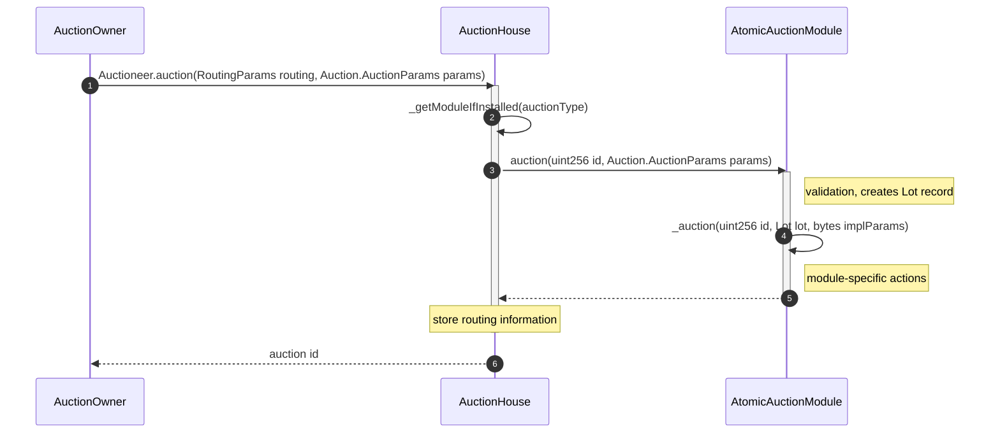
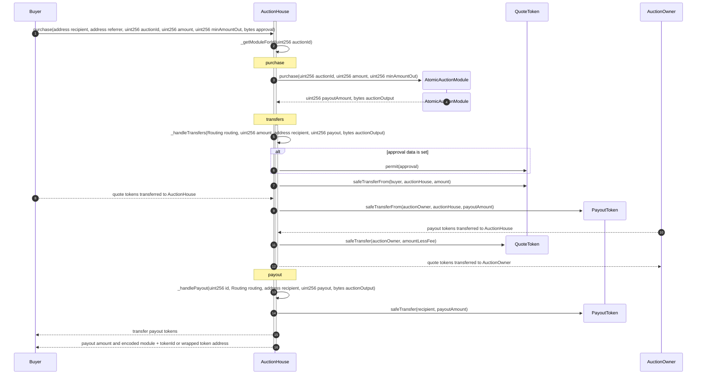
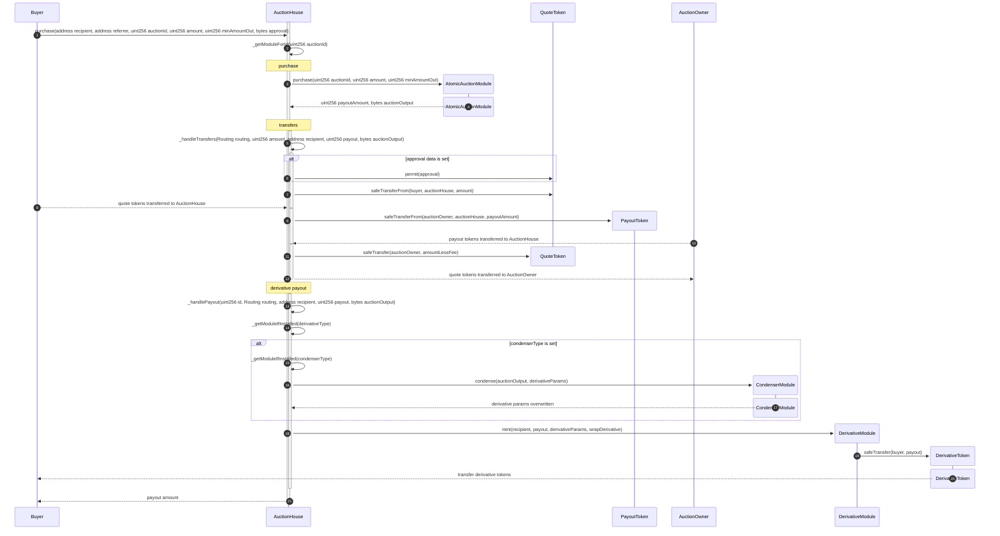
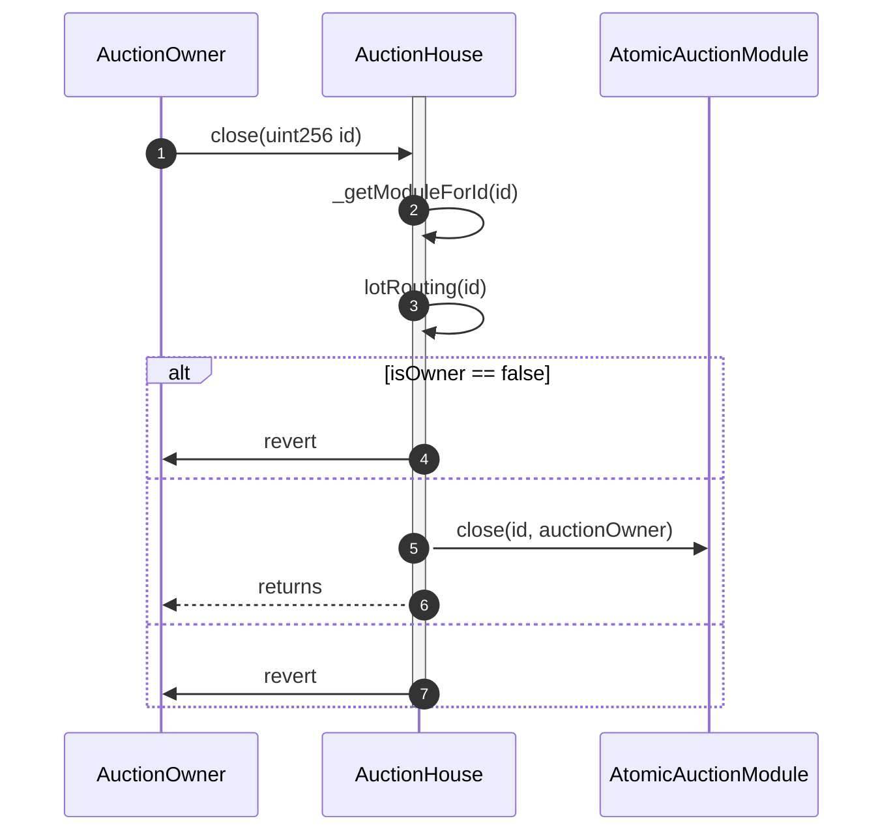
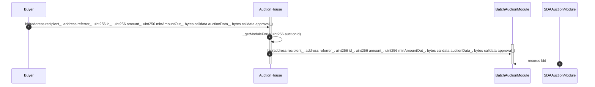
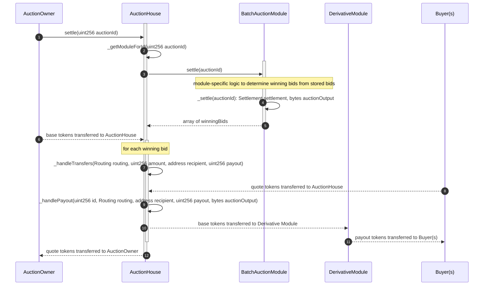
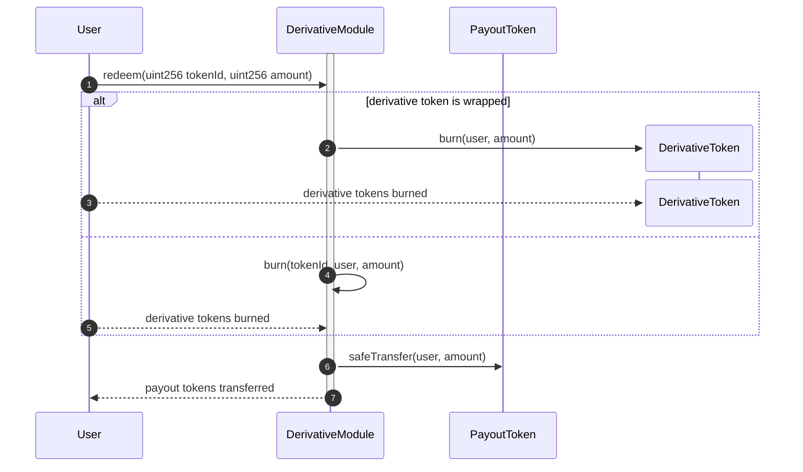

# Axis Architecture

## Contracts

```mermaid
classDiagram
  direction LR
  FeeManager --|> Router

  Owned --|> WithModules
  class Owned {
    <<Abstract>>
    +address owner
    ~onlyOwner()
    +transferOwnership(address newOwner,onlyOwner)
  }

  WithModules --|> Auctioneer
  class WithModules {
    <<Abstract>>
    +List~WithModules.Keycode~ modules
  }

  class Auctioneer {
    <<Abstract>>
    struct Routing
    struct RoutingParams
    +uint256 lotCounter
    +mapping[Keycode auctionType -> bool] typeSunset
    +mapping[uint256 lotId -> Routing] lotRouting
    +auction(RoutingParams routing, Auction.AuctionParams params) uint256
    +cancel(uint256 lotId)
    +payoutFor(uint256 lotId) Routing
    +priceFor(uint256 lotId, uint256 amount) uint256
    +maxPayout(uint256 lotId) uint256
    +maxAmountAccepted(uint256 lotId) uint256
    +isLive(uint256 lotId) bool
    +ownerOf(uint256 lotId) address
    +remainingCapacity(lotId) uint256
  }

  class FeeManager {
    <<Abstract>>
    +uint48 protocolFee
    +uint48 constant FEE_DECIMALS = 1e5
    +mapping[address referrer -> uint48] referrerFees
    +mapping[address -> mapping[ERC20 -> uint256]] rewards
    +claimFees(): uint256
  }

  class Router {
    <<Abstract>>
    ~address immutable treasury
    +purchase(address recipient, address referrer, uint256 lotId, uint256 amount, uint256 minAmountOut, bytes auctionData, bytes approval): uint256
    +batchPurchase(address recipient, address referrer, uint256[] lotIds, uint256[] amounts, uint256[] minAmountsOut, bytes[] auctionData, bytes[] approval): uint256[]
    +routePurchase(address recipient, address referrer, uint256[] lotIds, uint256 amount, uint256 minAmountOut, bytes[] auctionData, bytes approval): uint256
    +bid(address recipient, address referrer, uint256 lotId, uint256 amount, uint256 minAmountOut, bytes auctionData, bytes approval)
    +settle(uint256 lotId)
  }

  class Derivatizer {
    <<Abstract>>
    +transform(Keycode fromType, bytes calldata fromData, Keycode toType, bytes calldata toData, uint256 amount)
    +transform(Keycode fromType, uint256 fromTokenId, Keycode toType, bytes calldata toData, uint256 amount)
    +transform(Keycode fromType, uint256 fromTokenId, Keycode toType, uint256 toTokenId, uint256 amount)
  }

  class AuctionHouse {
    +purchase(address recipient, address referrer, uint256 lotId, uint256 amount, uint256 minAmountOut, bytes auctionData, bytes approval): uint256
    +batchPurchase(address recipient, address referrer, uint256[] lotIds, uint256[] amounts, uint256[] minAmountsOut, bytes[] auctionData, bytes[] approval): uint256[]
    +routePurchase(address recipient, address referrer, uint256[] lotIds, uint256 amount, uint256 minAmountOut, bytes[] auctionData, bytes approval): uint256
    ~handleTransfers(Routing routing, uint256 amount, uint256 payout, uint256 feePaid, bytes approval)
    ~handlePayouts(uint256 lotId, Routing routing, address recipient, uint256 payout, bytes auctionOutput)
    +bid(address recipient, address referrer, uint256 lotId, uint256 amount, uint256 minAmountOut, bytes32 auctionData, bytes approval)
    +settle(uint256 lotId): uint256[]
    +settle(uint256 lotId, Auction.Bid[] bids): uint256[]
  }

  class Condenser {
    <<Abstract>>
    +condense(bytes auctionOutput, bytes derivativeConfig): bytes combined
  }

  class Module {
    <<Abstract>>
    +address parent
    ~onlyParent()
    +KEYCODE(): Keycode
    #INIT()
  }

  class WithModules {
    <<Abstract>>
    +Keycode[] modules
    +mapping[Keycode => Module] getModuleForKeycode
    +mapping[Keycode => bool] moduleSunset
    #installModule(Module module)
    #sunsetModule(Keycode keycode)
    #execOnModule(Keycode keycode, bytes callData): bytes
    +getModules(): Keycode[]
    ~moduleIsInstalled(Keycode keycode): bool
    ~getModuleIfInstalled(Keycode keycode): Module
    ~validateModule(Module module): Keycode
  }

  AuctionModule ..> Auctioneer

  DerivativeModule ..> Derivatizer

  CondenserModule ..> AuctionHouse
  Auctioneer --|> AuctionHouse
  Derivatizer --|> AuctionHouse
  Router --|> AuctionHouse

  WithModules --|> Derivatizer

  Condenser --|> CondenserModule
  Module --|> CondenserModule

  Auction --|> AuctionModule
  Module --|> AuctionModule

  class Auction {
    <<interface>>
    struct Lot
    struct Bid
    struct AuctionParams
    +bool allowNewMarkets
    +uint48 minAuctionDuration
    ~uint48 _ONE_HUNDRED_PERCENT = 1e5
    +mapping[uint256 lotId => Lot] lotData
    +purchase(uint256 lotId, uint256 amount, bytes auctionData) (uint256, bytes)
    +bid(uint256 lotId, uint256 amount, uint256 minAmountOut, bytes auctionData) (uint256, bytes)
    +settle(uint256 lotId) uint256[]
    +settle(uint256 lotId, Bid[] bids) uint256[]
    +auction(uint256 lotId, address owner, AuctionParams params)
    +cancel(uint256 lotId)
    +payoutFor(uint256 lotId, uint256 amount) uint256
    +maxPayout(uint256 lotId) uint256
    +maxAmountAccepted(uint256 lotId) uint256
    +isLive(uint256 lotId) bool
    +ownerOf(uint256 lotId) address
    +remainingCapacity(uint256 lotId) uint256
  }

  class AuctionModule {
    <<abstract>>
    +purchase(uint256 lotId, uint256 amount, bytes auctionData) (uint256, bytes)
    +bid(uint256 lotId, uint256 amount, uint256 minAmountOut, bytes auctionData) (uint256, bytes)
    +settle(uint256 lotId) uint256[]
    +settle(uint256 lotId, Bid[] bids) uint256[]
    +auction(uint256 lotId, address owner, AuctionParams params)
    +cancel(uint256 lotId)
    +isLive(uint256 lotId) bool
    +ownerOf(uint256 lotId) address
    +remainingCapacity(uint256 lotId) uint256
  }

  Module --|> DerivativeModule
  Derivative --|> DerivativeModule
  ERC6909 --|> DerivativeModule

  class Derivative {
    <<abstract>>
    struct Token
    +mapping[uint256 tokenId => Token] tokenMetadata
    +deploy(bytes data, bool wrap) (uint256, address)
    +mint(bytes data, uint256 amount, bool wrapped) bytes
    +mint(uint256 tokenId, uint256 amount, bool wrapped) bytes
    +redeem(uint256 tokenId, uint256 amount, bool wrapped)
    +exercise(uint256 tokenId, uint256 amount, bool wrapped)
    +reclaim(uint256 tokenId)
    +wrap(uint256 tokenId, uint256 amount)
    +unwrap(uint256 tokenId, uint256 amount)
    #transform(uint256 tokenId, uint256 amount, bool wrapped)
    +exerciseCost(uint256 tokenId, uint256 amount) uint256
    +convertsTo(uint256 tokenId, uint256 amount) uint256
    +computeTokenId(bytes data) uint256
  }

  class ERC6909 {
    <<abstract>>
    +mapping[uint256 => uint256] totalSupply
    +mapping[address => mapping[address => bool]] isOperator
    +mapping[address => mapping[uint256 => uint256]] balanceOf
    +mapping[address => mapping[address => mapping[uint256 => uint256]]] allowance
    +transfer(address receiver, uint256 id, uint256 amount) bool
    +transferFrom(address sender, address receiver, uint256 id, uint256 amount) bool
    +approve(address spender, uint256 id, uint256 amount) bool
    +setOperator(address operator, bool approved) bool
    +supportsInterface(bytes4 interfaceId) bool
  }

  Module ..> WithModules

  AuctionModule --|> GDA
  AuctionModule --|> TVGDA

  DerivativeModule --|> CliffVesting
  DerivativeModule --|> StakedCliffVesting
  DerivativeModule --|> RageVesting
  DerivativeModule --|> FixedStrikeOption
  DerivativeModule --|> SuccessToken


```

### TODOs

-   [ ] Add section for Auction and Derivative module implementations after we prioritize which ones to build first
-   [ ] Create a function or add return values so that a solver / user can determine the derivative token that a market will return (useful for then creating off-chain orders for that token). This also brings up a point about how certain auction view functions that rely solely on an amount need to be refactored for a multi-variate auction world, e.g. `payoutFor(uint256)` -> `payoutFor(uint256, bytes)`

## Processes

### Create an Auction

### Purchase from an Atomic Auction (without callbacks)

#### No Derivative

#### With Derivative

### Close Atomic Auction

### Batch Auction: Buyer bids on an on-chain batch auction

### Batch Auction: Auction is settled from bids stored on-chain

### User Redeems Derivative Token

