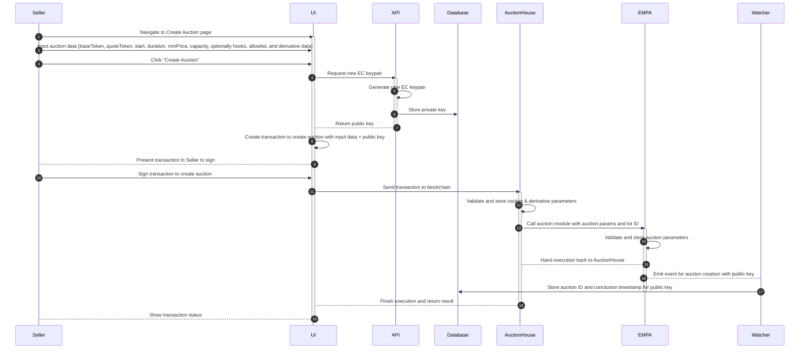
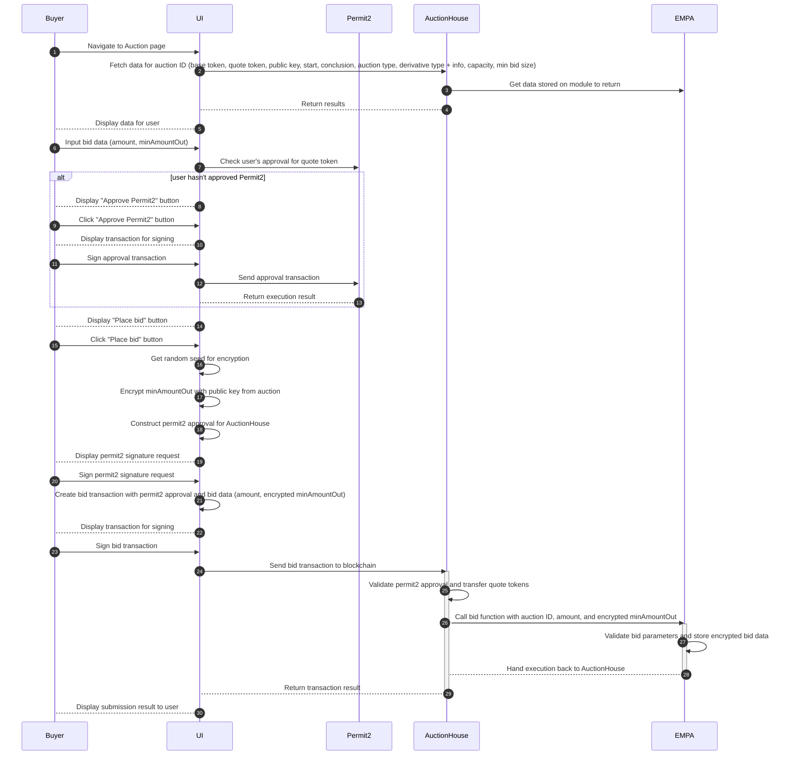
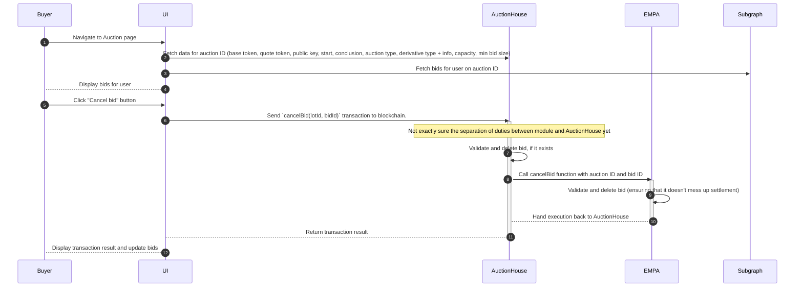
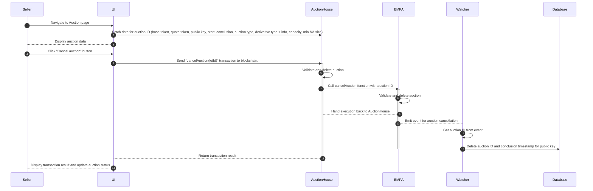
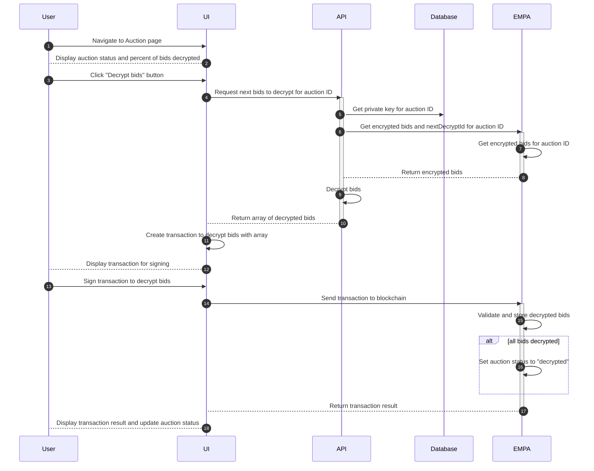
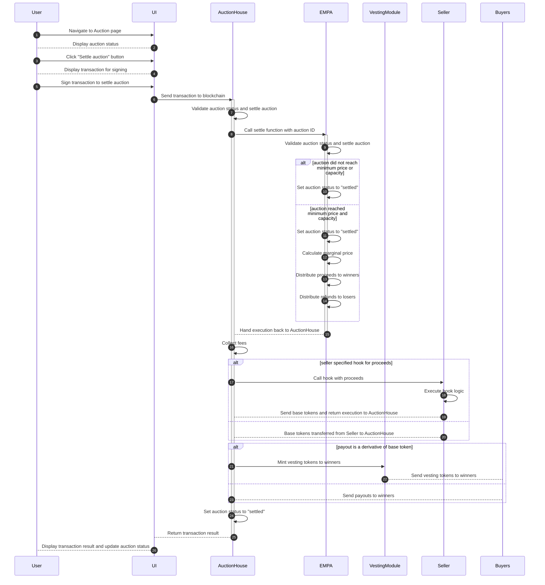

# EMPA: Encrypted Marginal Price Auctions

EMPA is a fully on-chain, sealed-bid, batch auction system built on the Axis Protocol that uses ECIES encryption and a multi-step settlement process to avoid issues of previous sealed bid auction designs. The purpose of the system is to allow any seller to create sealed-bid batch auctions for any ERC20 token pair. Sellers create an auction for a set amount of base tokens (capacity) and provide an EC public key for buyers to encrypt their bids with. Buyers encrypt a portion of their bids (the amount out) off-chain using the EC public key and submit them to the contract. The amount of quote tokens is public and the tokens they're bidding are sent to the contract on the bid. Once an auction ends, the settlement happens in two steps. First, the bids are decrypted off-chain, submitted to the contract, and verified by the contract. This can be done by anyone who has the private key to decrypt the bids off-chain. If the Seller uses the Axis dapp to deploy a market, the EC keypair is generated by an API and the private key is released after the auction concludes so that anyone can do the decryption. Once all the bids are decrypted, anyone can settle the auction and pay out proceeds to the winners. Those who do not win the auction can claim a refund following settlement.

## User Features

### Sellers
- Permissionlessly create sealed bid batch auctions, which improve execution over open bid auctions
- Auctions can be created for any (non-weird) ERC20 token pair
- Two transactions to create auction: 1. approve base token (if not already), 2. create auction
- Can limit auction participants using an allowlist
- Can use callbacks to customize functionality at various stages of the auction, including sourcing the payout and directing auction proceeds
- Can create and auction a derivative of the base token if desired
- Can enforce a minimum price and minimum capacity filled in order for auction to settle
- System is on-chain and transparent

### Buyers
- Permissionlessly place bids on any auction (assuming no allowlist)
- Bids are encrypted. Protocol key service hides private key from everyone, even sellers, so that no one can peek at your bids until after the auction is over.
- Settlement is permissionless
- System is on-chain and transparent

## Components and Design Decisions
This version of a sealed bid auction system has a few key properties that make it attractive:
1. Maximally Permissionless. The entire auction process happens on-chain and can be executed without relying on our off-chain infrastructure.
2. Transparent. All bids are encrypted and stored on-chain, but the bids are not decrypted until after the auction ends. This allows anyone to verify the bids and the settlement process.
3. Simple. As an early version of the system, we wanted to get something out that isn't too difficult to build.

However, the user experience is not as good as an off-chain or hybrid system could be. Specifically, users must submit transactions to bid, cancel a bid, and claim a refund if they do not win the auction. We plan for this system to only be used on chains where gas costs are low to mitigate the cost to both buyers and sellers. Additionally, because newer L2 chains don't have the same available of off-chain infrastructure and services as mainnet, it isn't possible to do some of the hybrid designs on these chains (e.g. web3 functions).

### Smart Contracts

#### Axis Protocol
Axis enables arbitrary auction and derivative combinations in a single settlement contract (the AuctionHouse). For this particular solution, there are only 3 contracts required.
  - Auction House
  - EMPA (Auction Module)
  - Vesting Module

#### Permit2 Approvals
Gasless for buyers after initial approval
[Permit2](https://github.com/Uniswap/permit2): Signature-based approvals for any ERC20 token
  - [Integration Guide](https://blog.uniswap.org/permit2-integration-guide)

### Encryption Key Management
What: Need to be able to encrypt bids and other data with a key that no interested party controls until the auction ends. This is to prevent insider dealing or other bad behavior.

Solution: API and private database that creates EC keypairs and store the private key until an auction ends. If an auction is cancelled, the private key is never released.

Axis will provide a simple API that provides key management for EC keypairs generated on auction creation. The API will generate a new keypair and store the private key in a database. The public key is returned to the user and stored on the auction contract. Once the auction ends, the private key is released from the database and can be used to decrypt the bids. The API will also provide a convenience function for returning the next bids that need to be decrypted for a given auction. This will allow anyone to decrypt the bids and submit them to the contract for verification.

The API will be written in Rust and the database will be a MongoDB instance following the architecture of the Bond Protocol Limit Orders system. This can be easily hosted on Railway and provides good CI/CD support.

In addition to the API, there will be a Rust service that watches for new auction creation events, checks whether the API provided the key, and stores the auction ID and conclusion timestamp in the database. This will allow the API to release the private key at the correct time. We need this service since we cannot be sure of the auction ID when a key is generated (it may be front-run by another transaction, for example).

### UI / dApp
We will provide a user interface (aka dApp) for both Sellers and Buyers to interact with the product. The key user actions are defined below in the Actions section. The core pages we be:
- List of auctions (TBD on design and filtering between statuses)
- Create auction page - for sellers to create new auctions
- Auction page - Details the status and available actions for a given auction. The auction page will need to support these differents states:
  - Created - Auction has been created, but not started
  - Live - Auction is created and currently accepting bids. Buyers should be able to bid and cancel bids they have made.
  - Concluded - Auction has ended and bids are being decrypted. Anyone should be able to decrypt the bids and submit them to the contract for verification.
  - Decrypted - Bids are decrypted and awaiting settlement. Anyone should be able to settle the auction.
  - Settled - Auction payouts have been issued. Buyers that did not win can claim refunds.

The architecture will be a Single Page App (SPA) hosted on [IPFS](https://docs.ipfs.tech/how-to/websites-on-ipfs/single-page-website/) with [Eth.limo](https://eth.limo/) domain resolution to ENS owned by the protocol.

#### Subgraph
In order to display user bids on the dapp, it is most convenient to use a subgraph to index the bids from events emitted from the smart contracts. Therefore, we will need to create a subgraph for the AuctionHouse (and possibly other modules depending on where the events reside).

## Actions

### Seller Creates Auction
A seller creating an auction is the first step in the lifecycle. They provide common auction parameters as well as auction specific parameters to the AuctionHouse contract to kick it off. They must approve the AuctionHouse for the token they are selling (base token) or provide a Hooks contract that will settle the auction 

### Buyer Places Bid

### Buyer Cancels Bid
Buyers are able to cancel bids they make prior to the auction concluding and receive their deposit back. The bid must be deleted from the stored bids so as to not require it to be decrypted.

### Seller Cancels Auction
Sellers are able to specify a start time for their auction in the future. If they want to cancel the auction before it starts, they can do so and the auction will be deleted. If the auction has already started and is accepting bids, then the seller can no longer cancel it.

### Auction Settlement Part 1: Decryption
After an auction has concluded, the bids must be decrypted and sorted by price. We do this by releasing the EC private key from the database via the API to anyone on the dapp looking at the auction page. Decryption works by providing an array of (amountOut, seed) for the bids in the order they were submitted to the contract. The seed was randomly generated on submission and can be extracted by decrypting the bid. The API provides a convenience function for returning an array for the next bids that need to be decrypted from an auction (using its ID). It may take several decryption transactions depending on the number of bids and gas limit. Once, all bids are decrypted on the contract, we can move to part 2 of the settlement process.

Note: this requires direct transactions to the EMPA auction module since the `decryptBids` function is not generic and won't be on the AuctionHouse

### Auction Settlement Part 2: Evaluate winners and send proceeds
The final step to settle an auction is to evaluate the sorted, decrypted bids to determine the marginal price for the auction and distribute funds to the winners. If the auction did not reach the minimum price or minimum fill capacity, then the auction is settled without winners, and users can claim refunds. If there are winners, then they are paid out the base tokens (or derivative) and the seller receives the proceeds. Users that do not win must claim a refund. The settlement function is open and can be called by anyone after the decryption process is complete.

## Marginal Price Settle Logic

### Terms
- Capacity - total amount of base tokens offered for sale
- Minimum Fill - minimum amount of base tokens that must be sold to settle auction
- Minimum Price - minimum amount of quote tokens per base token that must be received to settle auction
- Total Amount In - total amount of quote tokens received on auction settlement
- Total Amount Out - total amount of base tokens paid on auction settlement
- Marginal Bid ID - the last bid ID that settles at a given marginal price. if the marginal price is in between bids, then this will be zero.

### Goals
1. Fill as much of the capacity as possible with valid bids (above minimum price and minimum size)
2. Check for intermediate marginal prices that fill total capacity between bids to avoid large cliffs.
3. If not able to fill total capacity, try to settle the auction at the minimum price with a portion of the capacity (must be greater than the minimum fill).

### Mechanism

Note: We assume that bid IDs are indexed from 1 such that all bid IDs are non-zero.

1. Sort bids by price (high to low), then by order submitted (low to high). In EMPAM, bids are pre-sorted during decryption.
2. Iterate through the bids to find the ones that settle the auction to find: marginal price, marginal bid ID, partial fill ID, totalAmountIn, totalAmountOut
    - If current bid price < minimum price, we have seen all valid bids and weren't able to settle at last price. Check if the auction can be filled at the minimum price. If so, calculate the intermediate marginal price that fills the capacity (>= minimumPrice). If not, the minimum price is the marginal price. Set marginal bid ID to zero since no bids were submitted at the marginal price. Exit loop. Otherwise, continue.
    - Before considering the current bid, check if we can fill total capacity from previously considered bids at current bid price. If so, calculate the intermediate marginal price that fills the auction (>= currentPrice) and set marginalBidId to zero, which means no bids at the current price are included. Exit loop. Otherwise, continue.
    - Current bid is now considered. Increment totalAmountIn with current bid amount. Calculate totalAmountOut from totalAmountIn at currentPrice. If totalAmountOut is enough to fill capacity, then the marginal price is the current bid price. If totalAmountOut is strictly greater than capacity, then current bid is a partial fill. Set the marginal bid ID to the current bid ID. Exit loop. Otherwise, continue.
    - If this is the last bid in the queue, we have seen all valid bids and weren't able to settle at current price. Check if the auction can be filled at the minimum price. If so, calculate the intermediate marginal price that fills the capacity (>= minimumPrice). If not, the minimum price is the marginal price. Set marginal bid ID to zero since no bids were submitted at the marginal price.

3. Determine if Auction can be Settled:
    - If marginalPrice >= minimumPrice and totalAmountOut >= minimumFilled, then we can settle the auction. Save marginal price and marginal bid ID in storage. If partial bid ID is not zero, claim it now so we don't have to deal with it later. Send proceeds and refund (if any) to seller.
    - Otherwise, the auction cannot be settled. Save marginal price to a value greater than the highest bid price in storage so that all bids are refunded. Send refund to seller.