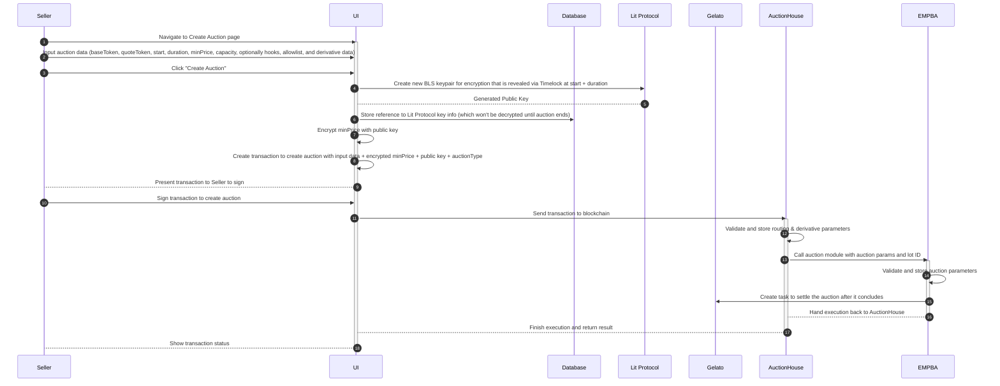
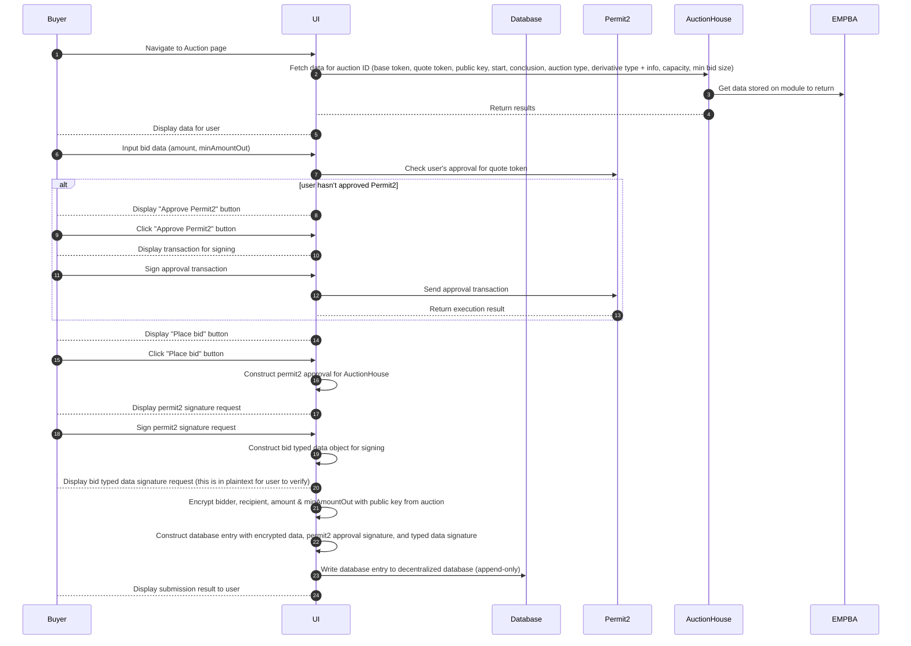
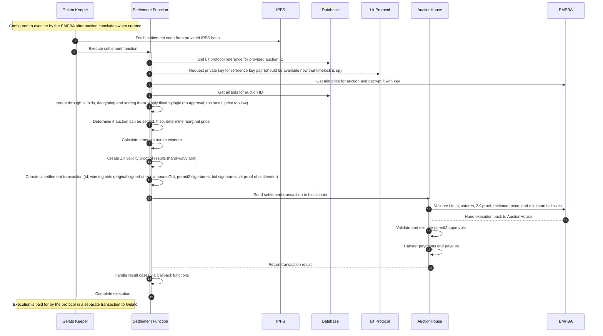

# HYDRA: Hybrid Decentralized Auctions

HYDRA (name TBD) is a hybrid on-chain/off-chain, sealed bid batch auction system built on the Axis Protocol that uses a variety of "web3" technology to achieve a strong balance between user experience, security, efficiency, and decentralization. The purpose of the system is to allow any seller to create sealed bid batch auctions for any ERC20 token pair. Buyers place bids off-chain on a decentralized UI where they are encrypted using a decentralized key management protocol and stored in a decentralized database. When the auction ends, a web3 function is executed to settle the auction. The settlement is verified with a validity proof on the auction contract, and the provenance of the bid data is ensured by protocol ownership of the execution function. The experience is gasless for buyers. Sellers post a transaction to the network when creating an auction, but do not have to execute additional transactions to settle the auction. A fee is taken from the auction proceeds and used is to compensate the settlement executor.

## User Features

### Sellers
- Permissionlessly create sealed bid batch auctions, which improve execution over open bid auctions
- Auctions can be created for any ERC20 token pair
- Two transactions to create auction: 1. approve base token (if not already), 2. create auction
- Settlement handled by protocol in a transparent and verifiable way
- Settlement fees are minimal due to complex logic being executed off-chain
- Can limit auction participants using an allowlist
- Can use hooks to customize transfer logic for auction proceeds
- Can create and auction a derivative of the base token if desired
- Can enforce a minimum price and minimum capacity filled in order for auction to settle

### Buyers
- Gasless experience: pay nothing if your bid is not executed
- Permissionlessly place bids on any auction
- Bids are encrypted using a decentralized key management protocol so that no one can peek at your bids
- Settlement handled by protocol in a transparent and verifiable way

## Components and Design Decisions
TODO

### Decentralization throughout the stack
TODO: most dapps are centralized in some way, but we can do better

### Smart Contracts

#### Axis Protocol
  - Auction House
  - EMPBA (includes ZK verifier for settlement proofs)

#### Permit2 Approvals
TODO: Gasless for buyers after initial approval
[Permit2](https://github.com/Uniswap/permit2): Signature-based approvals for any ERC20 token
  - [Integration Guide](https://blog.uniswap.org/permit2-integration-guide)

#### ZK Validity Proof of Settlement Logic
TODO: need to determine if we're actually going to do this. if the settlement address is compromised, a valid proof can be generated against the wrong data set
[Circom2 ZK Circuit Compiler](https://docs.circom.io/getting-started)

### Web3 Functions
Challenges: Bid Provenance problem, on-chain funding problem, gasless for sellers
Need: Trusted but Decentralized Execution of Settlement Logic
Solution:
[Gelato Web3 Functions](https://www.gelato.network/web3-functions): Automate smart contracts with off-chain logic and execution
  - [Typescript Functions](https://docs.gelato.network/developer-services/web3-functions/understanding-web3-functions/typescript-function)
  - [Create Task from Smart Contract](https://docs.gelato.network/developer-services/web3-functions/understanding-web3-functions/create-a-web3-function-task/using-a-smart-contract)

### Encryption Key Management
What: Need to be able to encrypt bids and other data with a key that no interested party controls until the auction ends. This is to prevent insider dealing or other bad behavior.

Solution:
[Lit Protocol](https://litprotocol.com): Decentralized key management protocol that can be used to generate a key pair, encrypt data, and decrypt the data based on certain conditions (e.g. a timelock).
- [Timelock Example](https://developer.litprotocol.com/v3/sdk/access-control/evm/timelock)
- [Encryption](https://developer.litprotocol.com/v3/sdk/access-control/encryption)

### UI
SPA hosted on [IPFS](https://docs.ipfs.tech/how-to/websites-on-ipfs/single-page-website/) with [Eth.limo](https://eth.limo/) domain resolution to ENS owned by the protocol

### Database
[OrbitDB](https://orbitdb.org/): decentralized database on IPFS, append-only

## Actions

### Seller Creates Auction

### Buyer Places Bid

### Auction Settled via Web3 Function

